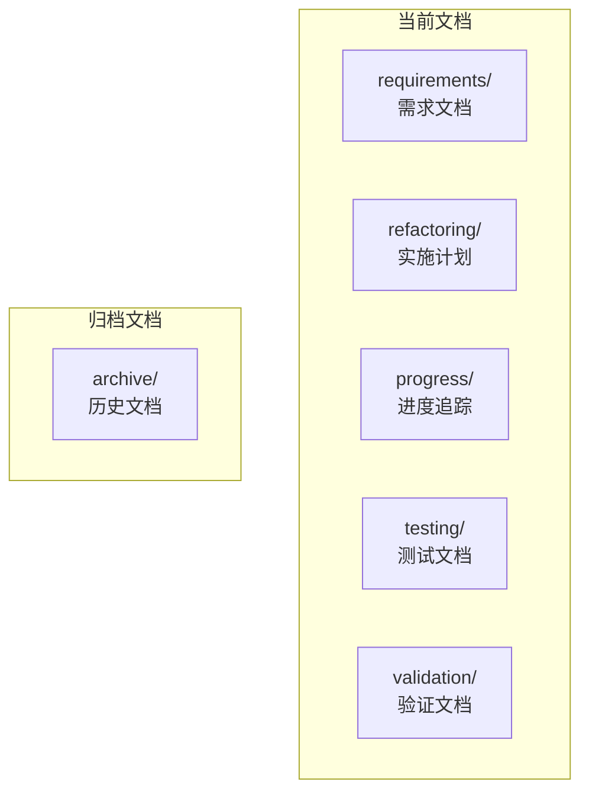

# WorkTool项目重构文档

## 项目概述

WorkTool是一个基于Android无障碍服务的企业微信自动化管理工具。这是项目的重构版本，完全使用Kotlin重写，采用现代化架构设计。

## 文档结构

## 文档导航

### 核心文档
- [重构实施计划](refactoring/implementation-plan.md) - 详细的重构方案和技术栈选型
- [功能需求规格](requirements/functional-requirements.md) - 完整的功能需求列表
- [测试规范](testing/README.md) - 测试策略和规范
- [验证标准](validation/README.md) - 功能验证标准和流程

### 进度相关
- [项目进度](progress/README.md) - 实时进度追踪
- [归档文档](archive/README.md) - 原项目参考文档

## 技术栈

### 1. 开发语言与框架
- Kotlin 1.9+ (唯一开发语言)
- Coroutines & Flow
- Hilt (依赖注入)
- Room (数据持久化)
- Kotlin Serialization

### 2. 核心组件
- Android AccessibilityService
- WebSocket 远程控制
- 插件化架构

### 3. 项目模块
- app: 主应用模块
- floatwindow: 悬浮窗模块
- baselibrary: 基础库模块

## 代码规范

1. 编码规范
   - 使用ktlint进行代码格式化
   - 遵循Kotlin官方编码规范
   - 所有公开API必须有文档注释

2. 提交规范
   - feat: 新功能
   - fix: 修复
   - docs: 文档
   - style: 格式
   - refactor: 重构
   - test: 测试
   - chore: 构建

## 性能目标

- UI响应时间 < 100ms
- 内存占用 < 200MB
- CPU使用率 < 30%
- 启动时间 < 2s
- ANR率 < 0.1%

## 安全要求

- 所有网络通信使用HTTPS
- 敏感数据加密存储
- 使用SafetyNet验证
- 实现防重放攻击
- 权限最小化原则

## CI/CD

- 提交时自动运行单元测试
- 合并到主分支时运行完整测试套件
- 自动化代码质量检查
- 自动化构建和发布