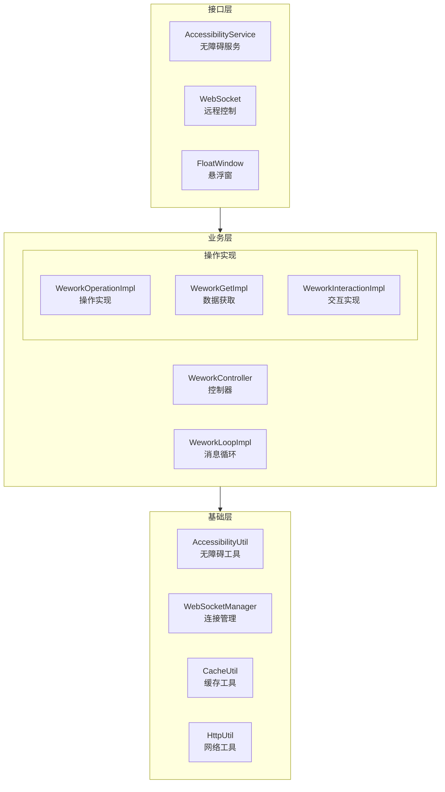
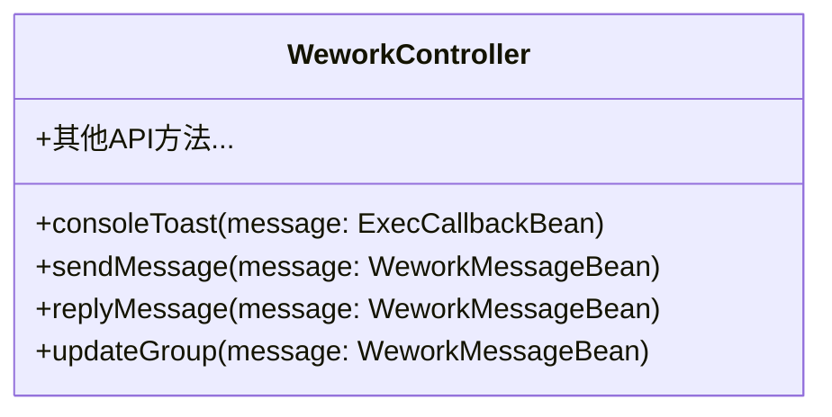
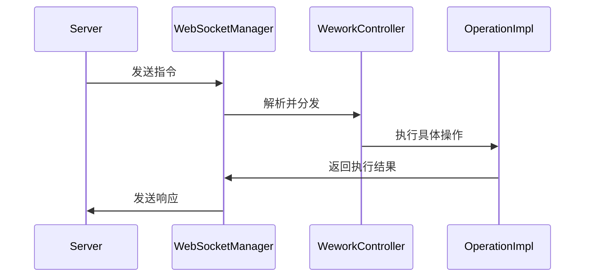
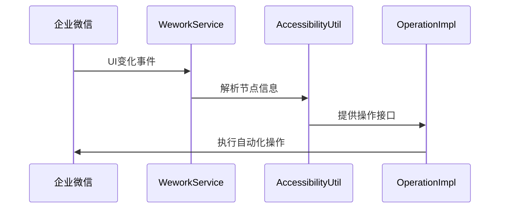
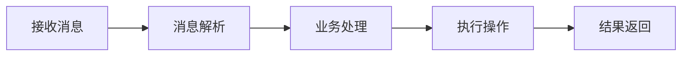
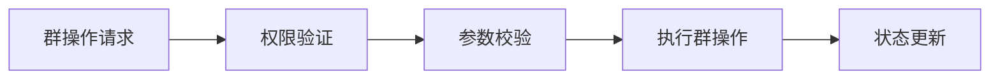
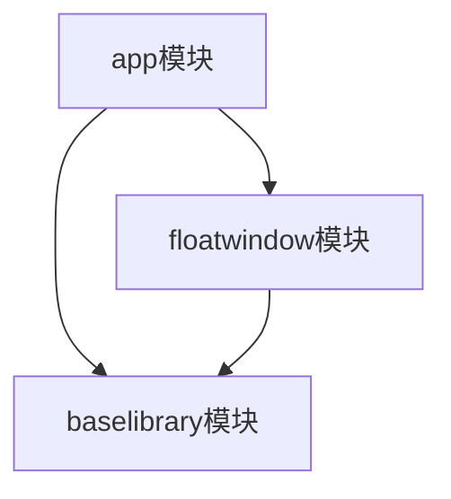

# 系统架构设计文档

## 整体架构

WorkTool采用模块化架构设计，基于Android无障碍服务实现企业微信的自动化操作。系统主要分为以下几个层次：



## 核心模块说明

### 1. 无障碍服务模块 (WeworkService)
- 继承自Android AccessibilityService
- 负责监听和处理企业微信的界面变化事件
- 管理WebSocket长连接
- 初始化系统核心组件

```kotlin
class WeworkService : AccessibilityService {
    // 核心功能
    - 事件监听处理
    - WebSocket管理
    - 文件监控
    - 自动化控制
}
```

### 2. 控制器模块 (WeworkController)
- 处理所有远程调用请求
- 统一的API入口
- 基于注解的请求分发



### 3. 操作实现模块
- WeworkOperationImpl: 具体操作实现
- WeworkGetImpl: 数据获取实现
- WeworkInteractionImpl: 用户交互实现
- WeworkLoopImpl: 消息循环处理

### 4. 工具模块
- AccessibilityUtil: 无障碍服务工具类
- WebSocketManager: WebSocket连接管理
- HttpUtil: 网络请求工具
- CacheUtil: 数据缓存工具

## 通信机制

### 1. WebSocket通信


### 2. 无障碍服务事件处理


## 数据流

### 1. 消息处理流程


### 2. 群管理流程


## 模块依赖

### 1. 主要依赖关系


### 2. 第三方依赖
- okhttp3: 网络请求
- utilcodex: 工具库
- kotlin-stdlib: Kotlin标准库

## 安全机制

1. 权限管理
   - 基于Android系统权限
   - 自定义权限控制
   - 数据访问控制

2. 数据安全
   - 本地数据加密
   - 通信加密
   - 敏感信息保护

## 扩展性设计

1. 插件机制
   - 自定义注解
   - 动态加载
   - 接口抽象

2. 配置化
   - 远程配置
   - 本地配置
   - 动态参数

## 性能优化

1. 内存管理
   - 对象池
   - 内存泄漏监控
   - 垃圾回收优化

2. 并发控制
   - 线程池管理
   - 异步操作
   - 任务队列