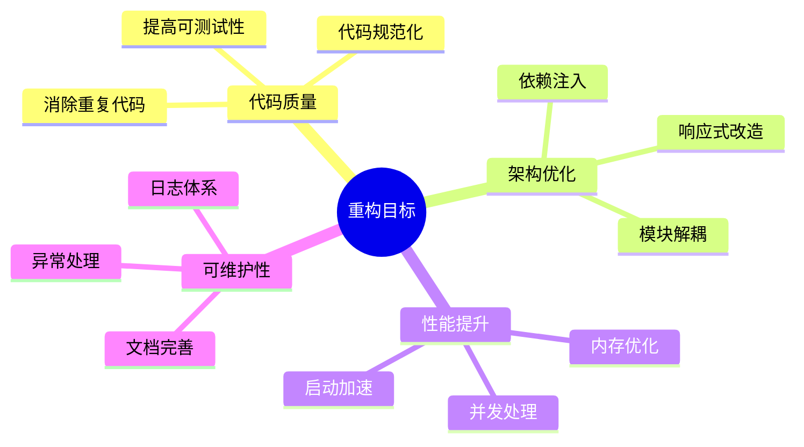
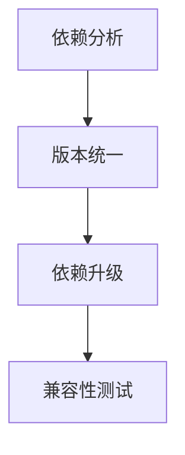
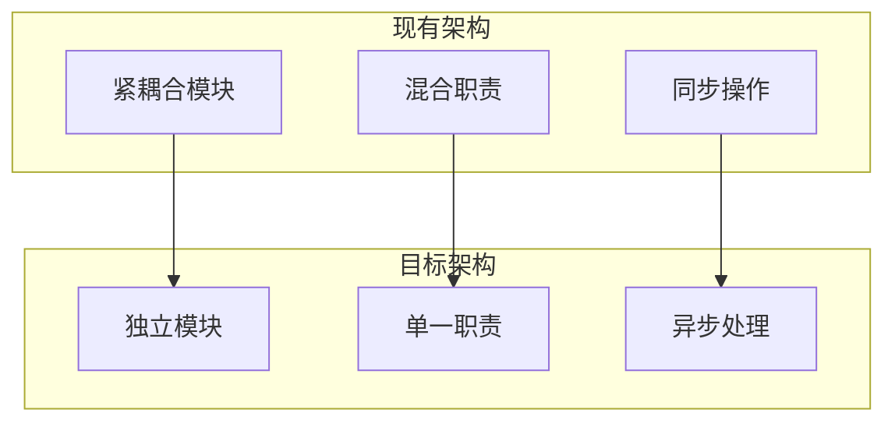
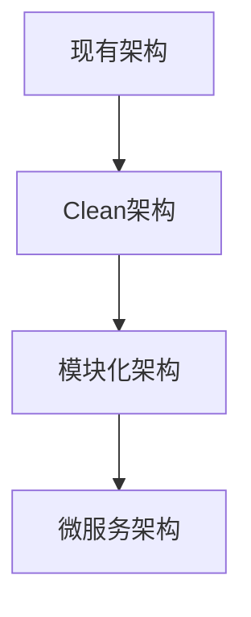
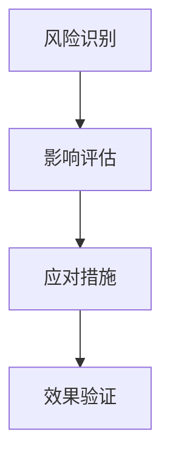
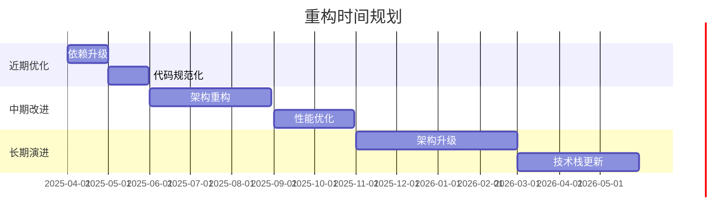

# 重构路线图

## 1. 概述

本文档提供了WorkTool项目的重构计划，包括近期优化、中期改进和长期演进三个阶段。重构的目标是提高代码质量、改善系统架构、提升性能和可维护性。

## 2. 重构目标

## 3. 近期优化（1-3个月）

### 3.1 依赖升级

#### 具体任务
1. 升级核心依赖
   - OkHttp升级到最新版本
   - Kotlin升级到1.8+
   - AndroidX组件更新

2. 移除过时API
   - 替换废弃的API调用
   - 更新编译目标版本
   - 适配Android新特性

### 3.2 代码规范化
1. 统一代码风格
   - 实施Kotlin编码规范
   - 添加代码格式化配置
   - 统一命名规范

2. 引入代码检查
   - 配置ktlint
   - 添加Detekt
   - 集成SonarQube

## 4. 中期改进（3-6个月）

### 4.1 架构重构

#### 具体任务
1. 模块化改造
   - 抽取独立模块
   - 定义模块接口
   - 实现模块解耦

2. 引入依赖注入
   - 集成Hilt框架
   - 重构依赖关系
   - 提高可测试性

### 4.2 性能优化
1. 内存优化
   - 实现对象池
   - 优化图片加载
   - 减少内存泄漏

2. 并发优化
   - 使用协程替代线程
   - 优化线程池管理
   - 实现异步操作

## 5. 长期演进（6个月以上）

### 5.1 架构升级

#### 具体任务
1. 引入Clean Architecture
   - 实现领域驱动设计
   - 分离业务逻辑
   - 建立清晰边界

2. 支持插件化
   - 实现插件框架
   - 支持动态加载
   - 提供扩展机制

### 5.2 技术栈更新
1. 响应式改造
   - 使用Flow替代回调
   - 实现响应式UI
   - 优化数据流

2. Jetpack组件集成
   - 使用ViewModel
   - 集成LiveData
   - 采用Room数据库

## 6. 风险与挑战

### 6.1 技术风险

#### 主要风险
1. 兼容性问题
   - 企业微信版本兼容
   - Android系统适配
   - 机型适配问题

2. 性能影响
   - 重构过程性能损失
   - 新架构性能影响
   - 内存占用变化

### 6.2 项目风险
1. 进度风险
   - 重构工作量大
   - 测试周期长
   - 资源有限

2. 质量风险
   - 功能regression
   - 新bug引入
   - 稳定性影响

## 7. 实施计划

### 7.1 时间规划

### 7.2 人力规划
1. 团队配置
   - 架构师 1名
   - 资深开发 2名
   - 开发工程师 3名
   - 测试工程师 2名

2. 职责分工
   - 架构设计和技术决策
   - 核心模块重构
   - 功能迁移和适配
   - 测试和质量保证

## 8. 监控与评估

### 8.1 监控指标
1. 代码质量
   - 代码覆盖率
   - 技术债务
   - Bug密度

2. 性能指标
   - 内存使用
   - 响应时间
   - 启动时间

### 8.2 评估方法
1. 定期评审
   - 代码评审
   - 架构评审
   - 性能评估

2. 数据分析
   - 性能数据
   - 崩溃数据
   - 用户反馈

## 9. 应急预案

### 9.1 回滚机制
1. 代码回滚
   - 版本控制
   - 增量发布
   - 快速回滚

2. 降级策略
   - 功能降级
   - 性能降级
   - 服务降级

## 10. 成功标准

### 10.1 质量指标
- 代码覆盖率 > 80%
- 重要模块测试覆盖 100%
- 零严重缺陷

### 10.2 性能指标
- 内存使用减少 30%
- 响应时间提升 50%
- 启动时间 < 2秒