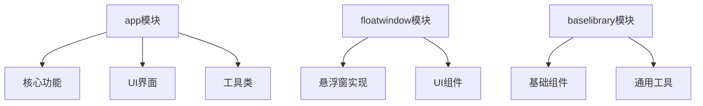
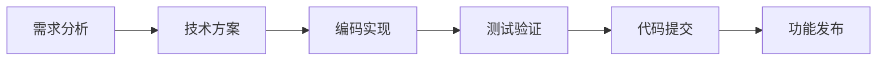
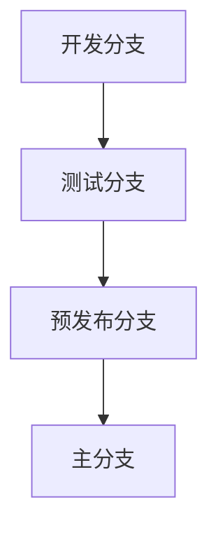

# 开发指南

## 1. 开发环境配置

### 1.1 必要条件
- Android Studio Arctic Fox或更高版本
- JDK 11或更高版本
- Gradle 7.0或更高版本
- Android SDK API 30或更高版本
- Android虚拟机或实体设备（Android 5.0+）

### 1.2 依赖配置
```groovy
dependencies {
    // 核心依赖
    implementation 'androidx.core:core-ktx:1.7.0'
    implementation 'org.jetbrains.kotlin:kotlin-stdlib:1.6.0'
    
    // 网络相关
    implementation 'com.squareup.okhttp3:okhttp:4.9.3'
    implementation 'com.squareup.retrofit2:retrofit:2.9.0'
    
    // 工具库
    implementation 'com.blankj:utilcodex:1.30.6'
    
    // WebSocket
    implementation 'org.java-websocket:Java-WebSocket:1.5.2'
}
```

## 2. 项目结构

### 2.1 模块说明


### 2.2 代码结构
```
app/
├── activity/     # 活动类
├── annotation/   # 注解类
├── config/      # 配置类
├── model/       # 数据模型
├── service/     # 服务实现
└── utils/       # 工具类
```

## 3. 开发流程

### 3.1 功能开发流程


### 3.2 代码规范

#### 命名规范
- 类名：大驼峰命名法
- 变量名：小驼峰命名法
- 常量：全大写+下划线
- 资源文件：小写+下划线

#### 代码格式
```kotlin
// 类定义
class MyClass {
    // 常量定义
    companion object {
        private const val MAX_COUNT = 100
    }
    
    // 变量定义
    private var count = 0
    
    // 方法定义
    fun doSomething() {
        // 实现
    }
}
```

### 3.3 测试规范

#### 单元测试
```kotlin
@Test
fun testMessageSend() {
    // 准备测试数据
    val message = WeworkMessageBean()
    
    // 执行测试
    val result = controller.sendMessage(message)
    
    // 验证结果
    assertTrue(result)
}
```

#### 集成测试
```kotlin
@Test
fun testWorkflow() {
    // 测试完整工作流
}
```

## 4. 调试指南

### 4.1 日志使用
```kotlin
// 日志级别
LogUtils.v() // 细节日志
LogUtils.d() // 调试日志
LogUtils.i() // 信息日志
LogUtils.w() // 警告日志
LogUtils.e() // 错误日志
```

### 4.2 断点调试
1. 设置断点
2. 使用调试模式运行
3. 查看变量值
4. 单步执行

### 4.3 性能分析
1. CPU Profiler使用
2. Memory Profiler使用
3. Network Profiler使用

## 5. 发布流程

### 5.1 版本管理


### 5.2 打包发布
1. 版本号更新
2. 混淆配置
3. 签名配置
4. 生成APK

## 6. 常见问题

### 6.1 权限问题
- 无障碍服务权限获取
- 悬浮窗权限获取
- 存储权限获取

### 6.2 兼容性问题
- 不同Android版本适配
- 不同企业微信版本适配
- 不同设备机型适配

### 6.3 性能问题
- 内存泄漏处理
- ANR问题处理
- 崩溃问题处理

## 7. 工具使用

### 7.1 必备工具
- Android Studio
- Git
- Postman
- Charles

### 7.2 推荐插件
- Kotlin
- Android WiFi ADB
- GsonFormat
- AndroidAutoSize

## 8. 最佳实践

### 8.1 代码质量
- 使用代码检查工具
- 遵循设计模式
- 编写单元测试

### 8.2 性能优化
- 内存优化
- 启动优化
- 网络优化

### 8.3 安全防护
- 数据加密
- 通信加密
- 代码混淆

## 9. 参考资源

### 9.1 官方文档
- [Android开发文档](https://developer.android.com)
- [Kotlin开发文档](https://kotlinlang.org)
- [企业微信开发文档](https://work.weixin.qq.com/api/doc)

### 9.2 学习资源
- Android开发者博客
- Kotlin官方博客
- GitHub示例项目