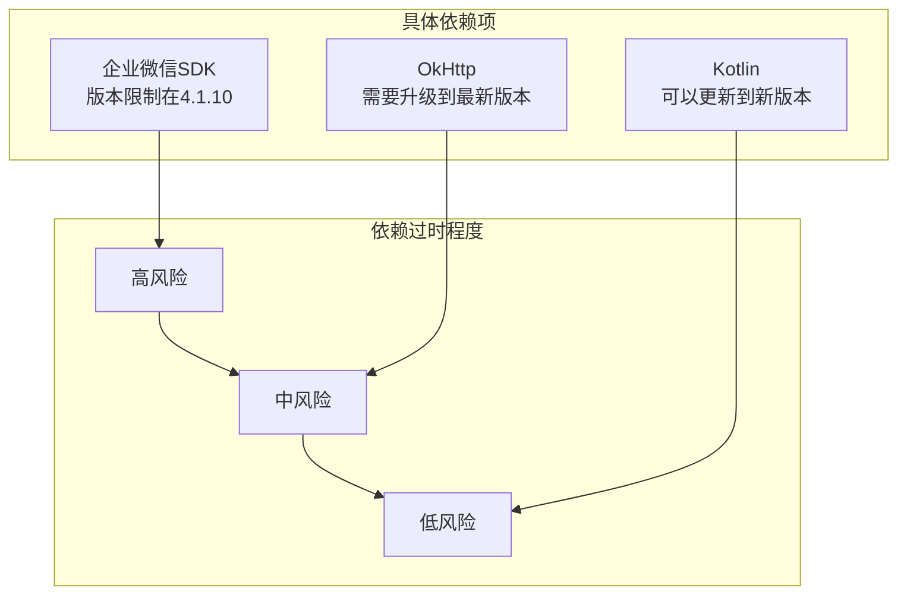
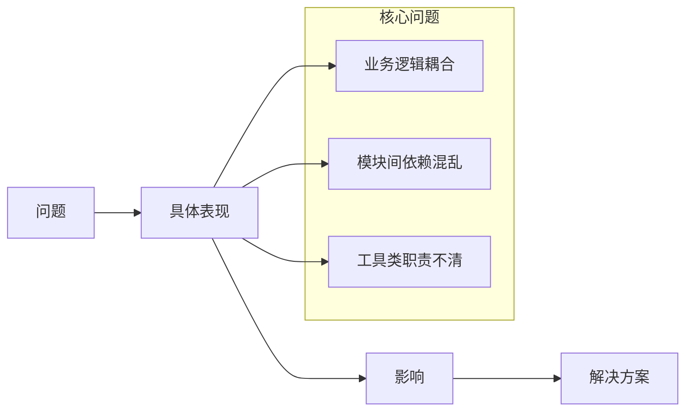
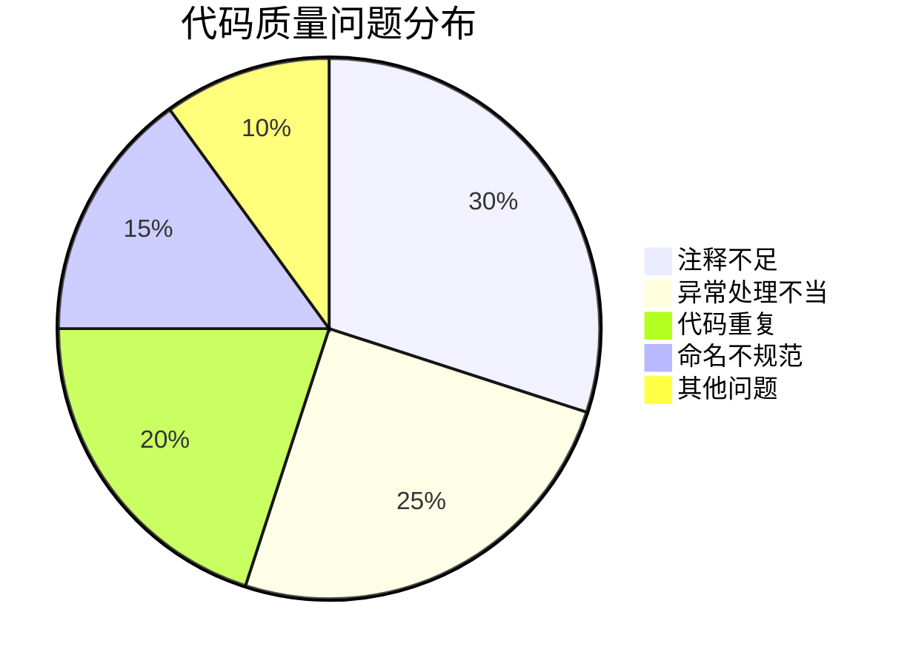
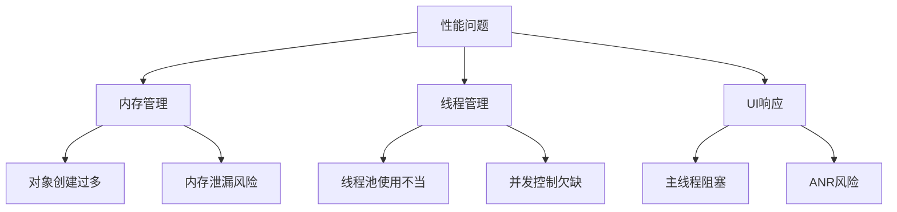
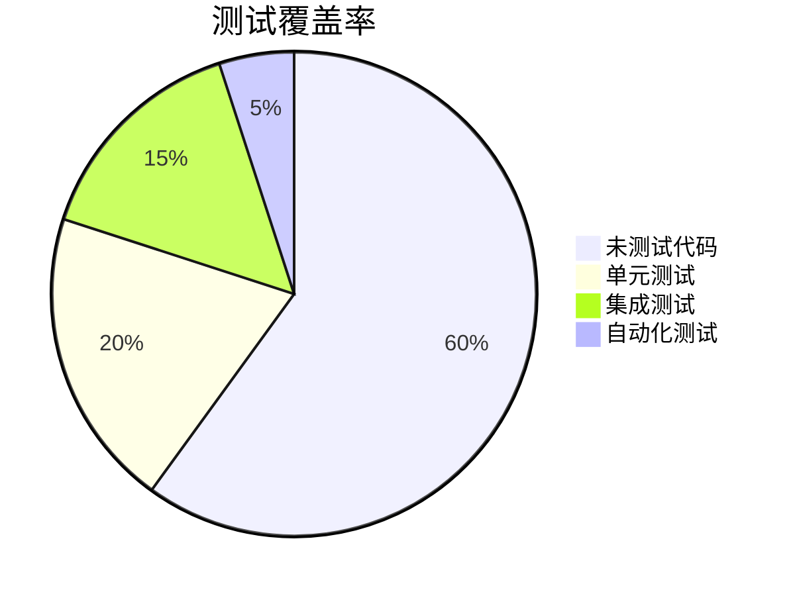

# 技术债务分析报告

## 概述

本报告对WorkTool项目进行全面的技术债务分析，包括代码质量、架构设计、依赖管理等方面，并提供相应的改进建议。

## 1. 依赖分析

### 1.1 过时的依赖项


### 1.2 主要问题
1. 企业微信SDK版本限制
   - 当前支持版本: 4.0.2 ~ 4.1.10
   - 影响: 无法支持最新版本企业微信
   - 风险: 高
   - 建议: 需要进行全面的兼容性改造

2. 第三方库版本老旧
   - OkHttp: 需要升级以修复安全问题
   - TalkingDataSDK: 建议评估替代方案
   - 其他依赖库: 需要版本统一管理

## 2. 架构问题

### 2.1 代码耦合


### 2.2 具体问题
1. 业务逻辑分散
   - WeworkController类职责过重
   - 操作实现类之间存在重复代码
   - 缺乏统一的异常处理机制

2. 模块化不足
   - 模块间界限模糊
   - 缺乏依赖注入机制
   - 配置管理不统一

## 3. 代码质量

### 3.1 代码问题


### 3.2 具体表现
1. 注释和文档
   - 关键方法缺乏注释
   - API文档不完整
   - 缺乏架构说明文档

2. 代码规范
   - 混用Kotlin和Java
   - 命名不一致
   - 代码格式不统一

## 4. 性能问题

### 4.1 主要性能瓶颈


### 4.2 具体问题
1. 内存管理
   - 频繁创建对象
   - 可能存在内存泄漏
   - 缓存策略不合理

2. 并发处理
   - 线程管理混乱
   - 锁使用不当
   - 异步操作处理不当

## 5. 安全隐患

### 5.1 主要安全问题
1. 数据安全
   - 敏感信息明文存储
   - 通信加密不足
   - 缺乏数据校验

2. 权限控制
   - 权限检查不严格
   - 缺乏访问控制
   - 日志记录不完整

## 6. 测试覆盖

### 6.1 测试情况


### 6.2 主要问题
1. 测试不足
   - 单元测试覆盖率低
   - 缺乏集成测试
   - 自动化测试不足

2. 测试质量
   - 测试用例设计不合理
   - 测试数据管理混乱
   - 缺乏性能测试

## 7. 改进建议

### 7.1 近期优化项
1. 依赖升级
   - 更新核心依赖版本
   - 统一依赖管理
   - 移除无用依赖

2. 代码质量
   - 添加必要注释
   - 统一代码规范
   - 补充单元测试

### 7.2 中期改进
1. 架构优化
   - 实现依赖注入
   - 优化模块划分
   - 重构核心功能

2. 性能优化
   - 优化内存管理
   - 改进线程控制
   - 加强异常处理

### 7.3 长期规划
1. 架构升级
   - 服务化改造
   - 引入响应式编程
   - 支持插件化架构

2. 自动化建设
   - 完善CI/CD
   - 建立自动化测试
   - 引入代码质量管理

## 8. 优先级矩阵

```mermaid
quadrantChart
    title 技术债务优先级矩阵
    x-axis 低影响 --> 高影响
    y-axis 低紧急 --> 高紧急
    quadrant-1 立即处理
        - 企业微信SDK升级
        - 核心安全问题
        - 严重性能问题
    quadrant-2 计划处理
        - 模块化改造
        - 测试覆盖
        - 代码规范
    quadrant-3 持续改进
        - 文档完善
        - 依赖更新
        - 代码重构
    quadrant-4 酌情处理
        - 新特性支持
        - 工具优化
        - 辅助功能