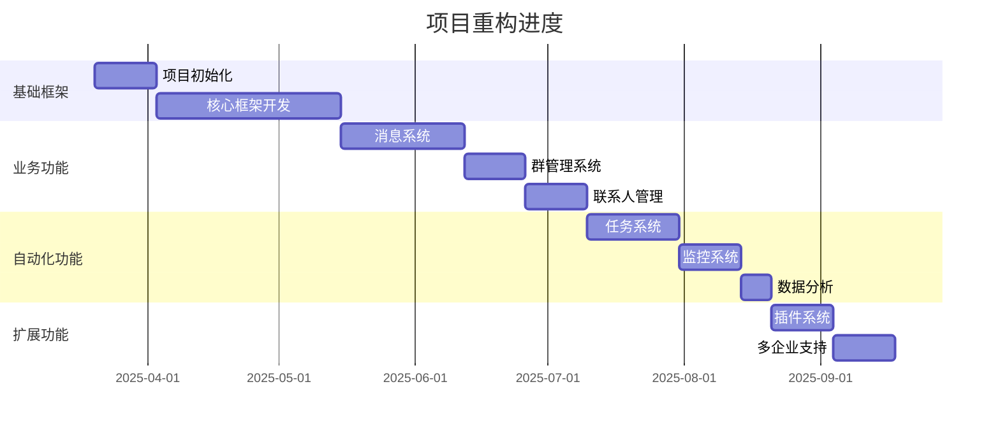

# 项目进度追踪

## 项目阶段



## 进度记录格式

### 1. 日常更新
每个功能完成后需要更新以下内容：

```markdown
## 功能模块：[模块名称]
日期：YYYY-MM-DD

### 完成内容
- [ ] 功能点1
- [x] 功能点2
- [-] 功能点3 (进行中)

### 测试结果
- 单元测试覆盖率：xx%
- 集成测试结果：通过/失败
- 性能指标：达标/未达标

### 遗留问题
1. 问题描述1
2. 问题描述2

### 下一步计划
1. 任务1
2. 任务2
```

### 2. 阶段评审
每个阶段结束时需要提供：

```markdown
## 阶段评审：[阶段名称]
日期：YYYY-MM-DD

### 完成度评估
- 计划完成项：xx项
- 实际完成项：xx项
- 完成率：xx%

### 质量评估
- 代码覆盖率：xx%
- Bug数量：xx个
- 性能达标率：xx%

### 风险评估
1. 风险1
2. 风险2

### 改进建议
1. 建议1
2. 建议2
```

## 项目里程碑

### 第一阶段：基础框架 (8周)
- [ ] 项目初始化设置
- [ ] 核心框架开发
- [ ] 基础设施搭建
- [ ] CI/CD配置

### 第二阶段：业务功能 (8周)
- [ ] 消息系统实现
- [ ] 群管理功能
- [ ] 联系人管理
- [ ] 数据同步

### 第三阶段：自动化功能 (6周)
- [ ] 任务系统
- [ ] 监控系统
- [ ] 数据分析
- [ ] 自动化测试

### 第四阶段：扩展功能 (4周)
- [ ] 插件系统
- [ ] 多企业支持
- [ ] 性能优化
- [ ] 安全加固

## 注意事项

1. 代码提交规范
   - feat: 新功能
   - fix: 修复
   - docs: 文档更新
   - style: 代码格式
   - refactor: 重构
   - test: 测试
   - chore: 构建

2. 文档更新要求
   - 功能说明文档
   - API文档
   - 测试用例文档
   - 架构设计更新

3. 验证标准
   - 单元测试覆盖率 > 80%
   - 集成测试覆盖率 > 60%
   - 性能指标达标
   - 代码审查通过