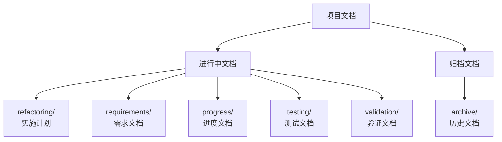
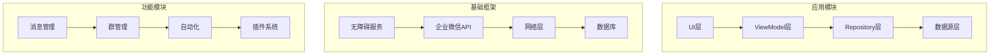

# WorkTool项目重构实施计划

## 文档结构说明



## 技术约束

### 1. 版本兼容性
- Android系统版本：5.0及以上
- 企业微信版本：4.0.2~4.1.10 (未来将支持更高版本)
- 主流机型适配要求
- 支持分辨率：720p - 2K

### 2. 性能指标
- UI响应时间 < 100ms
- 消息发送延迟 < 1s
- 群操作响应 < 2s
- 内存占用 < 200MB
- CPU使用率 < 30%
- ANR率 < 0.1%
- 启动时间 < 2s
- 后台内存 < 50MB

### 3. 安全要求
- 本地数据加密存储（AES-256）
- HTTPS通信加密
- 用户认证与授权
- 敏感信息保护
- 防重放攻击
- 日志脱敏
- SafetyNet认证

## 技术栈选型

### 1. 开发语言
```kotlin
// 仅使用Kotlin
kotlinOptions {
    jvmTarget = "17"
    languageVersion = "1.9"
    apiVersion = "1.9"
    freeCompilerArgs = listOf("-Xjsr305=strict")
}
```

### 2. 核心依赖
```kotlin
dependencies {
    // 核心框架
    implementation("org.jetbrains.kotlin:kotlin-stdlib:1.9.+")
    implementation("org.jetbrains.kotlinx:kotlinx-coroutines-android:1.7.+")
    
    // 依赖注入
    implementation("com.google.dagger:hilt-android:2.48+")
    kapt("com.google.dagger:hilt-compiler:2.48+")
    
    // 数据持久化
    implementation("androidx.room:room-runtime:2.6.+")
    implementation("androidx.room:room-ktx:2.6.+")
    kapt("androidx.room:room-compiler:2.6.+")
    
    // 网络请求
    implementation("com.squareup.okhttp3:okhttp:4.12.+")
    implementation("com.squareup.retrofit2:retrofit:2.9.+")
    implementation("com.squareup.retrofit2:converter-gson:2.9.+")
    
    // 序列化
    implementation("org.jetbrains.kotlinx:kotlinx-serialization-json:1.5.+")
    
    // 测试框架
    testImplementation("org.junit.jupiter:junit-jupiter:5.10.+")
    testImplementation("io.mockk:mockk:1.13.+")
    testImplementation("app.cash.turbine:turbine:1.0.+")
    androidTestImplementation("androidx.test.ext:junit:1.1.+")
    androidTestImplementation("androidx.test.espresso:espresso-core:3.5.+")
}
```

## 架构设计

### 1. 模块划分


### 2. 分层设计
```kotlin
// 领域模型
sealed interface Message {
    data class Text(val content: String)
    data class Media(val url: String, val type: MediaType)
    data class Action(val type: ActionType, val data: Map<String, Any>)
}

// 仓库层
interface MessageRepository {
    fun observeMessages(): Flow<List<Message>>
    suspend fun sendMessage(message: Message): Result<Unit>
    suspend fun loadHistory(count: Int): Result<List<Message>>
}

// 用例层
class SendMessageUseCase @Inject constructor(
    private val repository: MessageRepository,
    private val validator: MessageValidator
) {
    suspend operator fun invoke(message: Message): Result<Unit> = 
        validator.validate(message)
            .map { repository.sendMessage(it) }
}

// 视图模型
@HiltViewModel
class MessageViewModel @Inject constructor(
    private val sendMessage: SendMessageUseCase,
    private val messageRepository: MessageRepository
) : ViewModel()
```

## 实现计划

### 第一阶段：基础框架 (6周)
1. 核心服务
   - 无障碍服务实现
   - 企业微信API封装
   - WebSocket长连接
   
2. 数据层
   - Room数据库设计
   - Repository实现
   - 缓存策略

3. 网络层
   - Retrofit配置
   - 拦截器链
   - 错误处理

### 第二阶段：业务功能 (8周)
1. 消息系统
   - 消息发送接收
   - 消息存储同步
   - 消息类型处理

2. 群管理
   - 群生命周期
   - 成员管理
   - 设置管理

3. 联系人
   - 好友管理
   - 数据同步
   - 信息缓存

### 第三阶段：自动化功能 (6周)
1. 任务系统
   - 定时任务
   - 条件触发
   - 任务队列

2. 监控系统
   - 消息监控
   - 状态监控
   - 性能监控

3. 数据分析
   - 数据采集
   - 统计分析
   - 报表生成

### 第四阶段：扩展功能 (4周)
1. 插件系统
   - 插件加载
   - 生命周期
   - 通信机制

2. 多企业支持
   - 企业切换
   - 数据隔离
   - 权限管理

## 质量保证

### 1. 测试策略
```kotlin
// 单元测试示例
@Test
fun `发送消息成功后应更新状态`() = runTest {
    // Given
    val message = Text("测试消息")
    val repository = mockk<MessageRepository>()
    coEvery { repository.sendMessage(message) } returns Result.success(Unit)
    
    // When
    val result = SendMessageUseCase(repository).invoke(message)
    
    // Then
    assertTrue(result.isSuccess)
    coVerify { repository.sendMessage(message) }
}
```

### 2. 代码质量
- Ktlint检查
- Detekt静态分析
- SonarQube代码质量
- 代码覆盖率 > 80%

### 3. CI/CD
```yaml
name: Android CI

on:
  push:
    branches: [ main ]
  pull_request:
    branches: [ main ]

jobs:
  test:
    runs-on: ubuntu-latest
    steps:
      - uses: actions/checkout@v3
      - uses: actions/setup-java@v3
        with:
          java-version: '17'
      
      - name: Unit Tests
        run: ./gradlew test
      
      - name: Static Analysis
        run: ./gradlew ktlintCheck detekt

  build:
    needs: test
    runs-on: ubuntu-latest
    steps:
      - name: Build Debug
        run: ./gradlew assembleDebug
```

## 文档更新规则

每个功能模块完成后，需要更新以下文档：

| 文档类型 | 路径 | 更新内容 |
|---------|------|---------|
| 进度文档 | `/docs/progress/*.md` | 功能完成状态、测试结果 |
| 测试文档 | `/docs/testing/*.md` | 测试用例、覆盖率报告 |
| 验证文档 | `/docs/validation/*.md` | 功能验证结果、性能指标 |
| 实施文档 | `/docs/refactoring/*.md` | 实现细节、API说明 |
