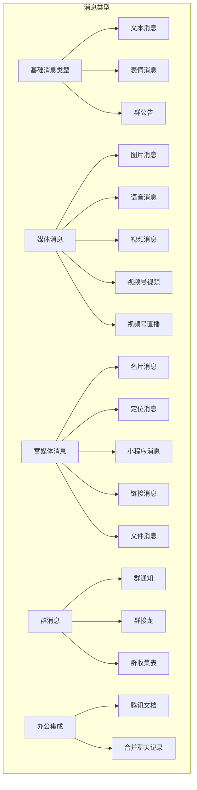
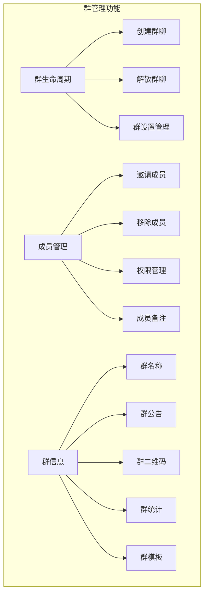
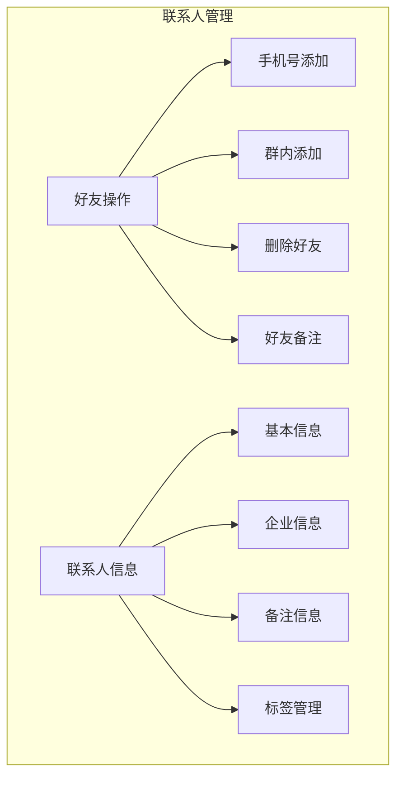
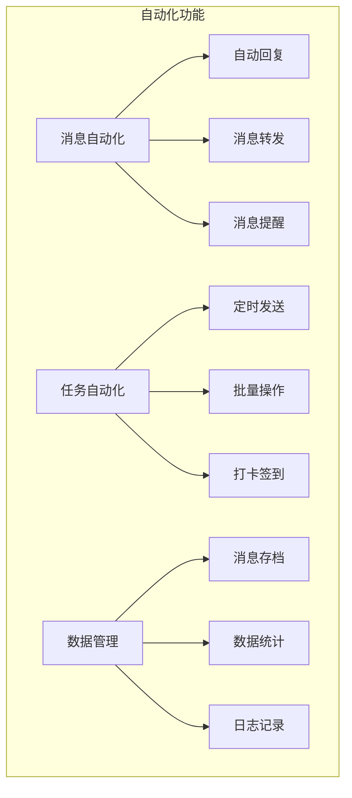

# 功能需求文档

## 1. 概述

WorkTool是一个基于Android无障碍服务的企业微信自动化管理工具，提供消息管理、群管理、联系人管理等功能。

## 2. 核心功能模块

### 2.1 消息管理

#### 具体功能规格
1. 基础消息类型
   - 文本消息：纯文本内容
   - 表情消息：表情符号
   - 群公告：群组通知内容

2. 媒体消息
   - 图片消息：支持发送和接收图片
   - 语音消息：语音通话记录
   - 视频消息：短视频内容
   - 视频号视频：企业视频号内容
   - 视频号直播：直播内容

3. 富媒体消息
   - 名片消息：个人名片分享
   - 定位消息：位置信息
   - 小程序消息：企业微信小程序
   - 链接消息：网页链接
   - 文件消息：文档文件

4. 群消息
   - 群通知：系统通知
   - 群接龙：互动消息
   - 群收集表：信息收集

5. 办公集成
   - 腾讯文档：在线文档
   - 合并聊天记录：消息汇总

### 2.2 群管理

#### 具体功能规格
1. 群生命周期管理
   - 创建群聊：指定成员创建群
   - 解散群聊：解散现有群组
   - 群设置：基本配置管理

2. 成员管理
   - 邀请成员：添加新成员
   - 移除成员：删除现有成员
   - 权限管理：设置管理员
   - 成员备注：设置成员备注

3. 群信息管理
   - 群名称：修改群名
   - 群公告：发布公告
   - 群二维码：获取二维码
   - 群统计：成员统计
   - 群模板：模板管理

### 2.3 联系人管理

#### 具体功能规格
1. 好友操作
   - 手机号添加：通过手机号搜索添加
   - 群内添加：从群聊添加好友
   - 删除好友：移除好友关系
   - 好友备注：设置备注名

2. 联系人信息
   - 基本信息：姓名、手机号
   - 企业信息：所属企业
   - 备注信息：备注名、描述
   - 标签管理：标签设置

### 2.4 自动化功能

#### 具体功能规格
1. 消息自动化
   - 自动回复：智能回复
   - 消息转发：自动转发
   - 消息提醒：重要提醒

2. 任务自动化
   - 定时发送：定时消息
   - 批量操作：群发功能
   - 打卡签到：自动打卡

3. 数据管理
   - 消息存档：历史记录
   - 数据统计：使用统计
   - 日志记录：操作日志

## 3. 房间类型定义

1. 外部群聊（ROOM_TYPE_EXTERNAL_GROUP = 1）
   - 包含外部成员的群组
   - 特殊权限管理
   - 敏感信息保护

2. 外部联系人（ROOM_TYPE_EXTERNAL_CONTACT = 2）
   - 非企业内部成员
   - 客户关系管理
   - 有限的信息获取

3. 内部群聊（ROOM_TYPE_INTERNAL_GROUP = 3）
   - 仅企业内部成员
   - 完整的管理权限
   - 企业信息共享

4. 内部联系人（ROOM_TYPE_INTERNAL_CONTACT = 4）
   - 企业内部成员
   - 完整的信息访问
   - 企业协作功能

## 4. 扩展功能

### 4.1 悬浮窗功能
- 快捷操作面板
- 消息提醒显示
- 状态信息展示

### 4.2 企业切换
- 多企业账号管理
- 快速切换功能
- 权限独立管理

## 5. 安全要求

### 5.1 数据安全
- 本地数据加密存储
- 通信内容加密
- 敏感信息保护

### 5.2 权限控制
- 用户身份验证
- 操作权限管理
- 敏感操作审计

## 6. 性能要求

### 6.1 响应时间
- 消息发送：小于1秒
- 群操作：小于2秒
- 自动回复：小于1秒

### 6.2 资源占用
- CPU使用率：低于30%
- 内存占用：小于200MB
- 存储空间：动态管理

## 7. 兼容性要求

### 7.1 系统要求
- Android 5.0及以上
- 企业微信4.0.2~4.1.10
- 主流机型适配

### 7.2 网络环境
- WiFi/4G/5G网络
- 弱网络适配
- 断网重连机制

## 8. 维护要求

### 8.1 日志管理
- 操作日志记录
- 错误日志记录
- 性能监控日志

### 8.2 异常处理
- 程序崩溃恢复
- 数据异常处理
- 网络异常重试

## 9. 其他要求

### 9.1 用户体验
- 界面响应流畅
- 操作简单直观
- 提供操作反馈

### 9.2 可扩展性
- 插件化架构支持
- 自定义功能配置
- API接口预留