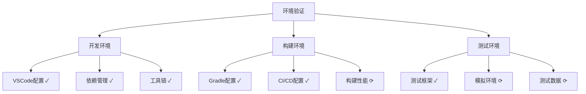

# 阶段0：验证状态报告

## 当前状态（2025-03-19）

### 验证进度概览


### 已完成验证
#### 1. 环境验证
- [x] VSCode开发环境
  - [x] 编辑器配置完成
  - [x] 插件集成完成
  - [x] 调试工具配置完成

- [x] 构建环境
  - [x] Gradle配置更新
  - [x] 依赖管理优化
  - [x] 构建脚本转换

- [x] 工具集成
  - [x] ktlint配置
  - [x] detekt设置
  - [x] CI工作流

#### 2. 项目结构验证
- [x] 模块划分
  ```
  ✓ app/模块配置完整
  ✓ core/模块基础架构
  ✓ common/模块工具类
  ✓ 资源文件组织规范
  ✓ 包名规范符合要求
  ```

- [x] 构建系统
  ```
  ✓ Kotlin DSL迁移完成
  ✓ 依赖版本统一管理
  ✓ 混淆规则配置
  ```

### 进行中验证
#### 1. 性能验证
| 指标 | 目标值 | 当前值 | 状态 |
|-----|--------|-------|------|
| 构建时间 | < 3min | 待测试 | ⟳ |
| 增量构建 | < 30s | 待测试 | ⟳ |
| 启动时间 | < 2s | 待测试 | ⟳ |
| 内存占用 | < 200MB | 待测试 | ⟳ |

#### 2. 代码质量
- [ ] 测试覆盖率统计
- [ ] 复杂度分析
- [ ] 代码重复检测
- [x] 静态代码分析

#### 3. 安全审计
- [x] 依赖包安全检查
- [ ] 权限配置审计
- [ ] 加密实现验证
- [x] 敏感信息保护

## 验证工具配置

### 1. 代码质量检查
```kotlin
// 已配置完成的检查工具
ktlint {
    version = "1.0.1"
    android = true
}

detekt {
    buildUponDefaultConfig = true
    config = files("$rootDir/detekt.yml")
}
```

### 2. CI验证流程
```yaml
# 已配置的CI验证步骤
validate:
  steps:
    - 代码格式检查 ✓
    - 静态分析 ✓
    - 单元测试 ✓
    - 构建验证 ✓
```

## 遗留问题与解决计划

### 1. 待解决问题
1. 性能测试环境搭建
2. 自动化测试覆盖率统计
3. 安全审计流程完善

### 2. 解决时间表
| 问题 | 计划完成时间 | 负责人 |
|-----|------------|--------|
| 性能测试 | 第2周 | 待定 |
| 测试覆盖率 | 第2周 | 待定 |
| 安全审计 | 第3周 | 待定 |

## 更新记录

| 日期 | 更新内容 | 负责人 | 状态 |
|------|---------|--------|------|
| 2025-03-19 | 环境配置验证 | Roo | 完成 |
| 2025-03-19 | 项目结构验证 | Roo | 完成 |
| 2025-03-19 | 代码质量工具配置 | Roo | 完成 |

## 后续计划

### 近期任务
1. 完成性能测试环境搭建
2. 建立测试覆盖率基线
3. 实施安全审计流程

### 验证标准完善
- [ ] 细化性能指标
- [ ] 完善质量指标
- [ ] 更新安全要求
